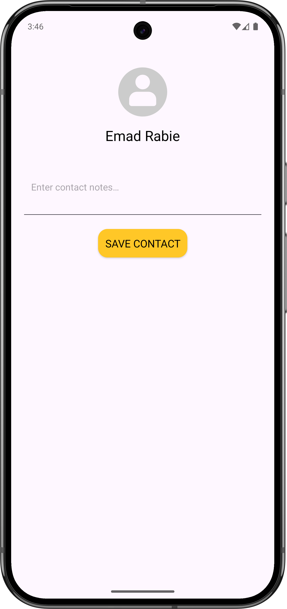
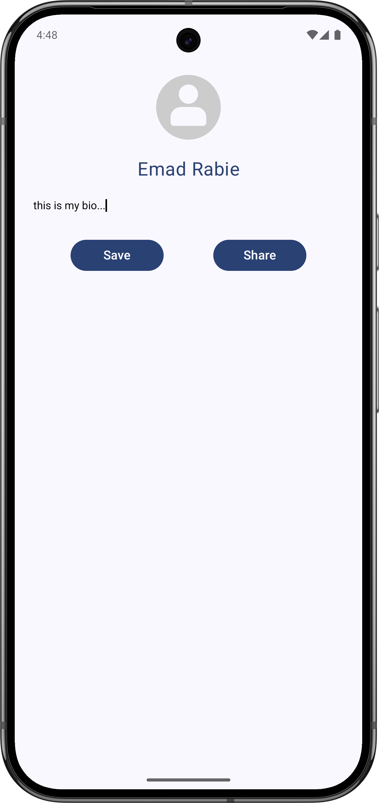

# Task ◖1◗: Hello Android App 

    
    
    

## Demo

## Lifecycle Methods

- **onCreate()**: Initializes the activity and its components upon creation in memory.
- **onStart()**: Makes the activity visible, moving it from background to foreground.
- **onResume()**: Enables user interaction with the activity in the foreground.
- **onPause()**: Disables interaction while the activity is partially visible in the foreground.
- **onStop()**: Moves the activity to the background, making it invisible.
- **onDestroy()**: Removes the activity from memory, cleaning up resources.

# Task ◖2◗ : Contact Manager UI (Static XML Screen)

# Task ◖3◗ : Profile UI with Jetpack Compose
**I understand that we haven't covered composition yet, but I have some background in it, and the AI provided slight assistance :)**

